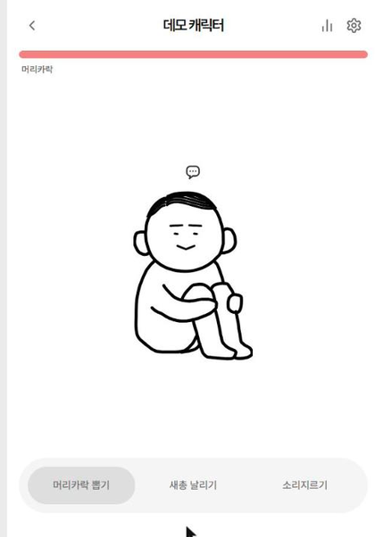
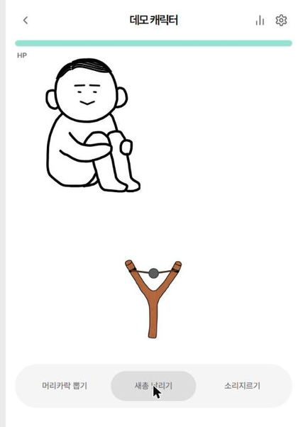
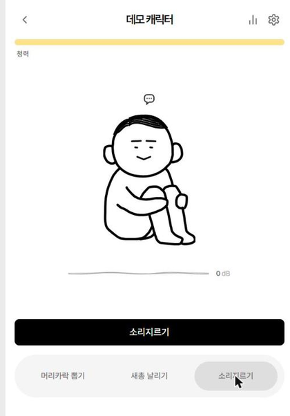

# I HATE YOU

스트레스 해소용 캐릭터 괴롭히기 앱. 내가 그린 얼굴로 나만의 캐릭터를 만들고, 머리카락을 뽑거나 새총으로 맞히거나 마이크에 소리를 질러서 스트레스를 풀 수 있습니다.

🔗 **배포 링크**: [ihateyou-orpin.vercel.app](https://ihateyou-orpin.vercel.app)

|            머리카락 뽑기            |            새총 날리기             |            소리지르기             |
| :----------------------------------: | :---------------------------------: | :---------------------------------: |
|  |  |  |

## 소개

하루 동안 쌓인 스트레스를 실제로 "그 사람"을 떠올리며 풀어보는 컨셉의 미니 웹앱입니다. 캔버스에 직접 얼굴을 그려 캐릭터를 만들고, 세 가지 방식으로 캐릭터를 괴롭히며 체력을 깎을 수 있습니다. 오늘 그 사람이 한 말을 말풍선으로 남겨두고 캐릭터와 함께 보여주는 등, 감정적 해소에 초점을 맞춘 인터랙션 위주로 구성했습니다.

## 주요 기능

### 캐릭터 생성/수정

- 캔버스에 펜/지우개로 직접 얼굴(눈, 코, 입 등)을 그려서 캐릭터 생성 — 처음엔 옅은 가이드 얼굴이 보이다가 선을 그리기 시작하면 사라짐
- 몸 색상, 머리카락 색상, 6가지 헤어스타일 중 선택 (선택 카드에 실제 헤어스타일 데이터를 축소 렌더링해서 보여줌)
- 그리기 되돌리기/다시 실행, 이름 설정
- 최대 10개까지 캐릭터를 만들어 홈 화면에 흩뿌려진 형태로 보관 (처음 진입 시 캐릭터가 없으면 `+` 버튼을 가리키는 안내 말풍선 표시)

### 괴롭히기 모드 (캐릭터 룸)

세 가지 탭으로 전환하며 각각 다른 스탯을 깎습니다.

| 모드 | 방식 | 깎이는 스탯 |
| --- | --- | --- |
| 머리카락 뽑기 | 머리카락 가닥을 손가락/마우스로 드래그해서 뽑기 (일정 거리 이상 당겨야 성공) | 머리카락 잔량 |
| 새총 날리기 | 새총을 당겼다 놓아 캐릭터를 맞히기 — 캐릭터는 가만히 있지 않고 계속 움직여서 조준이 필요함 | HP |
| 소리지르기 | 마이크에 대고 실제로 소리를 지르면 음량을 측정해서 데미지로 환산 — 청력이 깎일수록 귀에서 피가 흐르는 연출 추가 | 청력 |

- 모든 모드에서 "오늘 그 사람이 한 말"을 말풍선으로 등록/수정/삭제 가능 (다른 탭으로 전환하면 입력창 자동으로 닫힘)
- 머리카락이 완전히 빠지면 리필 버튼 등장
- 방을 나가 있는 동안에도 시간이 지나면 HP/청력/머리카락이 서서히 회복됨

### 통계

캐릭터별로 지금까지의 피격 기록을 확인할 수 있는 페이지.

- HP / 청력 / 머리카락 잔량 요약
- 공격 유형별 비중
- 최근 7일간 피격 추이 그래프
- 그동안 남긴 말풍선(그 사람이 한 말) 기록

## 기술적으로 신경 쓴 부분

- **실시간 마이크 데시벨 측정**: `getUserMedia` + `AnalyserNode`로 마이크 입력의 RMS 진폭을 dBFS로 변환하고, 실제 육성으로 지를 때의 체감 크기에 맞춰 0~100 점수로 정규화. Siri 스타일의 겹쳐진 sine 파형으로 실시간 음량을 시각화.
- **머리카락 뽑기 히트 판정**: 머리카락 가닥 하나하나를 실제 SVG path 그대로 히트 영역(굵은 투명 stroke)으로 사용해서, 눈에 보이는 곡선을 그대로 클릭/드래그할 수 있게 구현. 캐릭터 SVG와 오버레이 SVG의 viewBox를 완전히 동일하게 맞춰서 좌표 변환 없이 원본 path 데이터를 재사용.
- **상태 관리/영속성**: zustand의 `persist` 미들웨어로 캐릭터 데이터를 로컬스토리지에 저장. 여러 캐릭터의 공격 기록, 스탯 회복 시각 등을 관리.
- **SPA 라우팅 + Vercel 배포**: `react-router`의 `BrowserRouter` 사용, `vercel.json`의 rewrite 설정으로 새로고침/직접 진입 시에도 라우팅이 깨지지 않도록 처리.

## 기술 스택

- **Frontend**: React 19, TypeScript, Vite
- **상태 관리**: Zustand (persist)
- **라우팅**: React Router
- **스타일**: SCSS Modules
- **폰트**: Pretendard
- **배포**: Vercel

## 시작하기

```bash
npm install
npm run dev       # 개발 서버 실행
npm run build     # 프로덕션 빌드 (tsc + vite build)
npm run lint       # eslint 검사
npm run preview    # 빌드 결과 미리보기
```

## 프로젝트 구조

```
src/
  pages/            # 라우트 단위 화면 (홈, 생성, 수정, 룸, 통계)
  components/
    character/      # 캐릭터 렌더링, 얼굴 캔버스, 헤어/색상 선택 UI
    stats/          # 통계 페이지 전용 카드/차트 컴포넌트
    common/         # 버튼, 뒤로가기 등 공용 컴포넌트
  store/            # zustand 캐릭터 스토어 (persist)
  hooks/            # 마이크 데시벨 측정 등 커스텀 훅
  constants/        # 헤어스타일 SVG 데이터 등
  utils/            # 날짜, 통계 계산, 레이아웃 유틸
```
